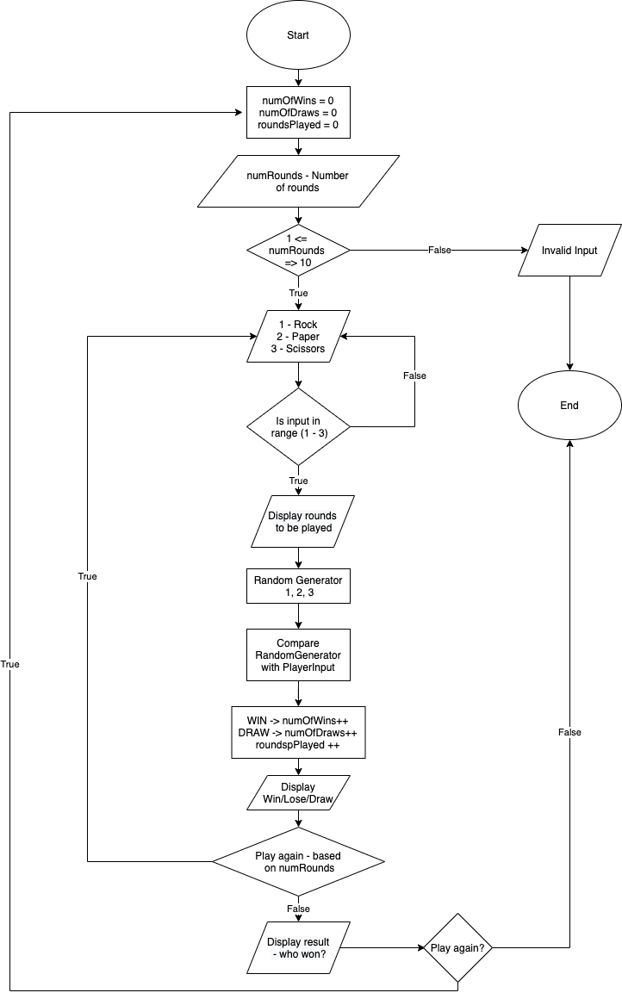

# **Rock, Paper, Scissors**

## Prerequisites:
* Java 11.0

# Instructions
In this lab, you will write a program that plays the game Rock, Paper, Scissors.

## Your Task List:
- Create a flowchart.
- Show your flowchart to your instructor.
- After receiving approval for your flowchart, begin writing code.

### Rules
The rules of the game are as follows:
- Each player chooses Rock, Paper, or Scissors.
- If both players choose the same thing, the round is a tie.
Otherwise:
- Paper wraps Rock to win
- Scissors cut Paper to win
- Rock breaks Scissors to win

### Flowchart
